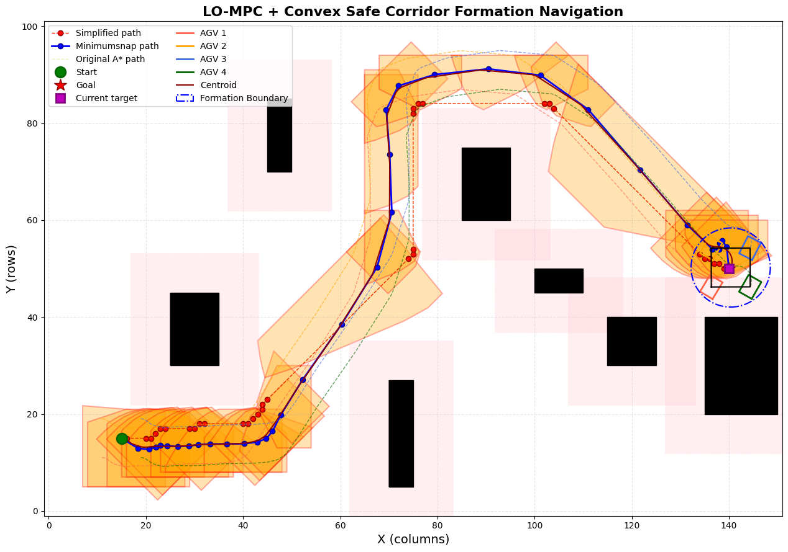
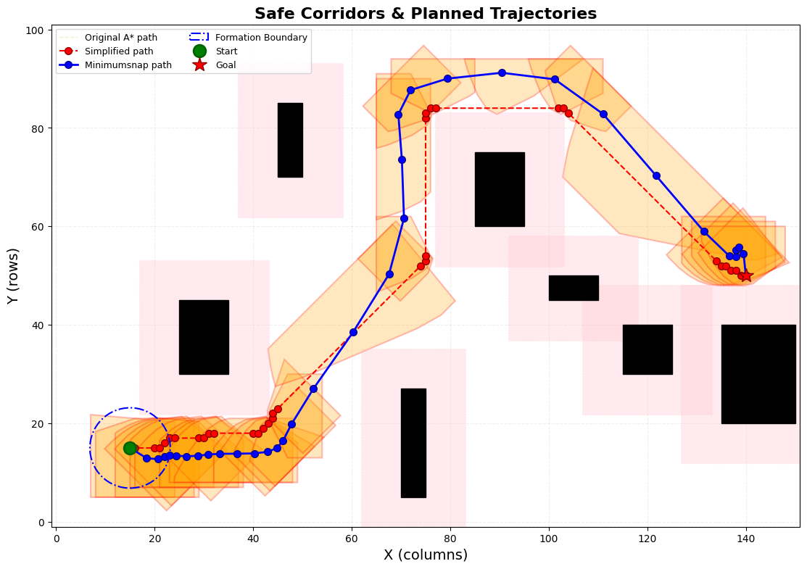
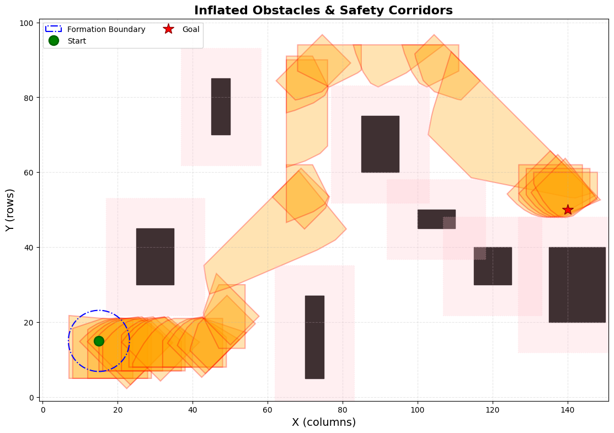

# Corridor-LO-MPC

> 面向多移动机器人（AGV）编队导航与无碰撞避障的系统级运动规划与控制开源框架（本科毕业设计课题《基于CSC-LOMPC的多移动机器人运动规划》代码实现）。

[](LICENSE)
[](pyproject.toml)
[](https://web.casadi.org/)

---

## 📖 项目简介

`Corridor-LO-MPC` 是一个面向多移动机器人（AGV）刚体编队协同导航与无碰撞避障的系统级规划控制框架。针对复杂受限及狭窄通道环境下多 AGV 协同搬运重型货物的痛点，项目结合了**凸安全走廊 (Convex Safe Corridor, CSC)**、**改进 $A^*$ 全局路径搜索**、**Minimum Snap 高阶连续轨迹平滑优化**与**字典序优化模型预测控制 (Lexicographic Optimization MPC, LO-MPC)**，实现了端到端的运动规划与编队高精度控制闭环。

针对传统加权求和 MPC 人工权重整定繁琐、易导致高优先级目标被淹没的缺陷，本项目构建了“刚度保持 ($P_1$) $>$ 质心导航 ($P_2$) $>$ 控制平滑 ($P_3$)”的绝对优先级分层优化架构，保证编队在复杂狭窄走廊中既能安全避障，又能严格保持刚性队形。

---

## 🌟 核心特性与技术亮点

- **全流程运动规划架构**：涵盖地图构建、Minkowski 障碍物膨胀、全局路径搜索、路径抽稀、凸安全走廊膨胀、高阶轨迹平滑至编队闭环控制全链条。
- **凸安全走廊生成 (CSC)**：采用半平面切除与多面体贪心膨胀算法，将复杂自由空间中的非凸几何避障约束转化为紧凑的线性不等式硬约束：
  $$\mathbf{A}_i \mathbf{p} \le \mathbf{b}_i$$
- **高阶连续平滑轨迹优化**：在走廊边界约束下，使用 OSQP 求解 Minimum Snap 二次规划问题，生成位置、速度、加速度乃至跃度（Jerk）连续的高质量参考轨迹。
- **字典序模型预测控制 (LO-MPC)**：基于 CasADi 符号建模并调用 Ipopt 内点法求解非线性分层优化问题，在数学上严格保证高优先级目标（编队刚度与防畸变）的优先满足。
- **高实时性与精度指标**：
  - 支持 **4 台差速 AGV** 刚体编队协同作业；
  - 密集走廊轨迹跟踪误差 $< 0.05\text{ m}$；
  - 编队内部距离误差峰值 $\le 0.015\text{ m}$，稳态达到毫米级；
  - 单步求解耗时与 **50ms 控制周期**处于同一数量级，满足在线实时控制需求。

---

## 🛠️ 方法流程 / Pipeline

```text
[二维栅格与障碍环境]
         │
         ▼
[Minkowski 安全膨胀]
         │
         ▼
[改进 A* 搜索初始可行路径]
         │
         ▼
[路径拓扑抽稀 & 提取关键航点]
         │
         ▼
[构造连续凸安全走廊 (CSC)] ───► 将非凸避障转化为线性不等式 A_i p ≤ b_i
         │
         ▼
[Minimum Snap 轨迹平滑优化] ───► 基于 OSQP 求解高阶连续轨迹
         │
         ▼
[分层字典序 LO-MPC 控制器] ───► P1: 编队刚度 > P2: 质心导航 > P3: 输入平滑
         │
         ▼
[输出轨迹、走廊、速度与误差分析]
```

---

## 📂 项目结构

```text
Corridor-LO-MPC/
├── README.md                 # 项目详细说明文档
├── pyproject.toml            # Python 项目配置与依赖管理 (PEP 621)
├── uv.lock                   # 锁定的确定性依赖版本
├── main.py                   # 主仿真运行入口脚本
├── draw_inflation.py         # 障碍物膨胀与地图绘制辅助脚本
├── lexHMPC/                  # 字典序模型预测控制核心模块
│   ├── HMPC.py               # LO-MPC 控制器核心建模与求解器接口
│   ├── Form.py               # 编队刚体几何拓扑约束定义
│   ├── Navi.py               # 质心轨迹跟踪目标函数
│   ├── Orient.py             # 机器人朝向协调与姿态约束
│   ├── Delta_U.py            # 控制输入变化率平滑目标
│   ├── Avoid.py              # 凸走廊线性边界硬约束
│   └── ...
├── utils/                    # 规划与几何算法工具箱
│   ├── ConvexCorridor2.py    # 凸安全走廊 (CSC) 生成算法
│   ├── MapBuilder.py         # 栅格地图构建与障碍物解析
│   ├── CorridorDrawing.py    # 走廊多边形可视化渲染
│   ├── Drawing.py            # 轨迹与动态编队绘图组件
│   ├── Astar.py              # A* 路径搜索算法实现
│   └── ...
├── simulation/               # 实验与仿真测试用例
│   ├── Simulation1.py        # 典型狭窄走廊多机避障场景仿真
│   └── output/               # 实验输出保存路径
└── output/                   # 主仿真运行生成图像与指标数据
    └── main/
```

---

## 💻 环境配置与安装

本项目使用现代 Python 包管理器 [uv](https://github.com/astral-sh/uv) 进行高效依赖管理。

### 环境要求
- Python `>= 3.13`
- 核心求解器与数值计算库：
  - `casadi`（非线性符号优化与 Ipopt 接口）
  - `cvxpy`（凸优化与二次规划接口）
  - `numpy`, `scipy`, `matplotlib`, `shapely`, `opencv-python`

### 一键安装
```bash
# 克隆仓库
git clone https://github.com/Messi666j/Corridor-LO-MPC.git
cd Corridor-LO-MPC

# 使用 uv 一键安装并同步虚拟环境
uv sync
```

---

## 🚀 运行仿真

### 1. 运行全流程主仿真
```bash
uv run python main.py
```
*自动完成地图构建、走廊生成、轨迹优化与 4 机编队 LO-MPC 求解，并保存可视化图表。*

### 2. 运行典型对比仿真
```bash
uv run python simulation/Simulation1.py
```

---

## 📊 实验结果与可视化

运行后仿真图表将自动保存至 `output/main/` 目录下：

### 1. 编队协同与最终避障全貌


### 2. 编队轨迹总览


### 3. 凸安全走廊构建效果


---

## ⚙️ 关键实验参数

| 参数名 | 默认值 | 作用与说明 |
| :--- | :---: | :--- |
| `ROBOT_NUM` | `4` | 刚体编队中的移动机器人数量 |
| `obstacle_regions` | 见脚本配置 | 定义二维栅格地图中的复杂障碍分布 |
| `destination` | `(x, y)` | 编队质心导航的目标位姿 |
| `N` | `10 ~ 20` | LO-MPC 预测时域长度（平衡前瞻性与计算实时性） |
| `dt` | `0.05 s` | 离散控制步长（对应 20Hz / 50ms 闭环更新频率） |

---

## 📄 许可证

本项目遵循 [MIT License](LICENSE) 开源许可证。